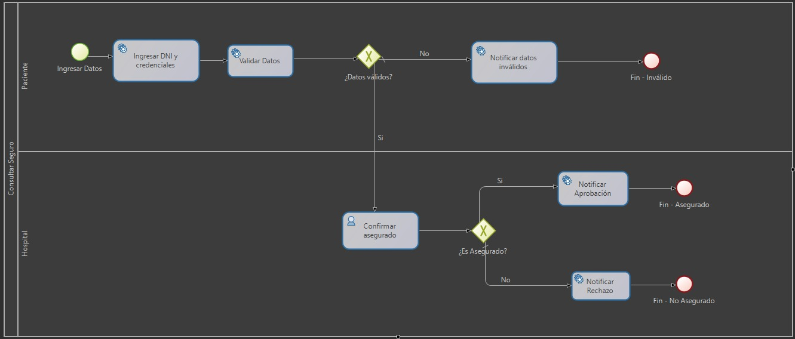
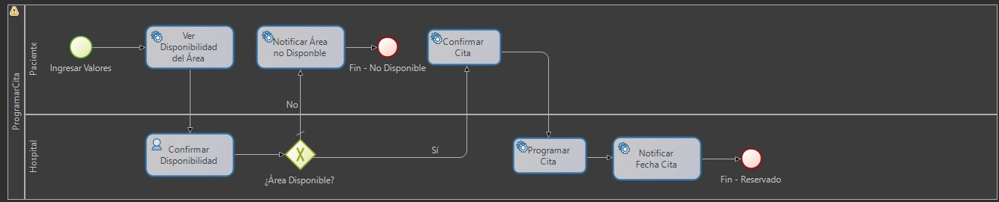

## 🏥 Repositorio del Proyecto: **Programación de Citas Médicas - EsSalud**

### � Tecnologías y Herramientas Utilizadas

- **Spring Boot** (Backend, API REST)
- **PostgreSQL** (Base de datos relacional)
- **BonitaSoft Studio** (Modelado y automatización de procesos BPMN)
- **Swagger/OpenAPI** (Documentación y pruebas de la API)
- **Postman** (Pruebas automatizadas de endpoints)

### �📌 Propósito


Este proyecto tiene como objetivo modelar, implementar y documentar el proceso de negocio **"Programar una Cita Médica"** utilizando prácticas de **DDD (Domain-Driven Design)** y una arquitectura basada en capas, mediante el framework **Spring Boot** y una base de datos **PostgreSQL**. Además, se diseñaron y automatizaron diagramas de procesos BPMN en **BonitaSoft Studio** para la gestión de flujos de negocio. Se busca mejorar la modularidad, escalabilidad y mantenibilidad del sistema de agendamiento de citas médicas para la organización **EsSalud**.

---


---

### 🧱 Vista General de Arquitectura y Módulos

La estructura del proyecto está organizada según los principios de **Arquitectura Limpia**, **DDD** y el patrón **MVC**, usando las convenciones de Spring Boot y JPA.

```bash
src/
└── main/
    ├── java/
    │   └── com/
    │       └── backend/
    │           └── backend/
    │               ├── BackendApplication.java
    │               ├── controller/             # Controladores REST por módulo funcional
    │               │   ├── CitaController.java
    │               │   ├── AseguradoController.java
    │               │   ├── MedicoController.java
    │               │   ├── PacienteController.java
    │               ├── service/                # Lógica de aplicación (coordinación de casos de uso)
    │               │   ├── CitaService.java
    │               │   ├── AseguradoService.java
    │               │   ├── MedicoService.java
    │               │   ├── PacienteService.java
    │               │   ├── NotificacionService.java
    │               ├── domain/                 # Modelo de Dominio
    │               │   ├── model/              # Entidades y lógica de dominio
    │               │   │   ├── Cita.java
    │               │   │   ├── Especialidad.java
    │               │   │   ├── Asegurado.java
    │               │   │   ├── Medico.java
    │               │   │   ├── Paciente.java
    │               │   ├── repository/         # Interfaces JPA
    │               │   │   ├── CitaRepository.java
    │               │   │   ├── AseguradoRepository.java
    │               │   │   ├── MedicoRepository.java
    │               │   │   ├── PacienteRepository.java
    │               ├── infrastructure/
    │               │   ├── external/           # Conexión a servicios externos
    │               └── dto/                    # Objetos para Request y Response
    │                   ├── CitaRequest.java
    │                   ├── CitaResponse.java
    │                   ├── AseguradoRequest.java
    │                   ├── AseguradoResponse.java
    │                   ├── MedicoRequest.java
    │                   ├── MedicoResponse.java
    │                   ├── PacienteRequest.java
    │                   ├── PacienteResponse.java
    └── resources/
        ├── application.properties
        ├── static/
        ├── templates/
```

---


### 🧠 Modelo de Dominio y Procesos

- `Cita.java`: Representa una cita médica con atributos como `dni`, `fecha`, `especialidad`, `centroAsignado`, etc.
- `Asegurado.java`: Entidad para la gestión de asegurados.
- `Medico.java`: Entidad para la gestión de médicos.
- `Paciente.java`: Entidad para la gestión de pacientes.
- `Especialidad.java`: Catálogo de especialidades médicas.
- Repositorios JPA para cada entidad.


#### 📋 Modelado de Procesos BPMN
Se diseñaron diagramas de procesos en **BonitaSoft Studio** para automatizar el flujo de programación de citas, notificaciones y gestión de pacientes.

##### Diagramas BPMN implementados

<p align="center">
  <b>Consulta de Seguro</b><br>
  
</p>

<p align="center">
  <b>Programar Cita</b><br>
  
</p>

Los objetos de dominio encapsulan la lógica central y permiten separar responsabilidades entre capas de presentación, aplicación e infraestructura.

---


### 📝 Código Fuente y Control de Versiones

Todos los cambios están versionados y documentados con mensajes de commit claros en este repositorio. Se han utilizado ramas como:

- `main`: Rama estable y desplegable.
- `develop`: Rama de desarrollo principal.
- `feature/programar-cita`: Funcionalidad específica del proceso de agendamiento.
- `feature/notificaciones`: Gestión de envío de correos electrónicos al paciente.
- `feature/asegurado`, `feature/medico`, `feature/paciente`: Nuevos módulos implementados para la gestión de asegurados, médicos y pacientes.


### 📮 Pruebas y Documentación de la API

- **Swagger/OpenAPI**: Documentación interactiva disponible para todos los endpoints REST.
- **Postman**: Colección de pruebas automatizadas para los endpoints principales (`citas`, `asegurados`, `medicos`, `pacientes`).
  - 📁 Las colecciones y entornos se encuentran en la carpeta [`postman/`](./postman/):
    - `postman(Hospital).json`
    - `postman(Enviroment).json`

#### 🚀 Ejemplo de solicitud para programar cita

```json
POST /api/citas
Content-Type: application/json
{
  "dni": "12345678",
  "fecha": "2025-07-22",
  "especialidad": "Pediatría",
  "fechaDeseada": "2025-07-30"
}
```

#### ✅ Tests incluidos (Postman)

```javascript
pm.test("Código de estado 200", function () {
    pm.response.to.have.status(200);
});
pm.test("Respuesta contiene campos esperados", function () {
    const json = pm.response.json();
    pm.expect(json).to.have.property("centroAsignado");
    pm.expect(json).to.have.property("mensaje");
});
```

💡 Puedes importar la colección en Postman usando el botón **"Import"** y cargando el archivo `.json`. Luego, presiona **"Send"** para probar el endpoint directamente desde la interfaz.

---

### 👥 Equipo de Trabajo

- Lizardo Manuel Castillo Llaza
- Karla Veronica Cornejo Pari
- Jose Alejandro Machaca Muniz

---

### 📄 Notas adicionales

- Se diseñaron y modelaron procesos BPMN en BonitaSoft Studio para la automatización de flujos.
- El backend expone endpoints REST documentados con Swagger/OpenAPI.
- Se implementaron módulos para la gestión de asegurados, médicos, pacientes y notificaciones.
- Pruebas automatizadas y ejemplos de uso disponibles en Postman.

